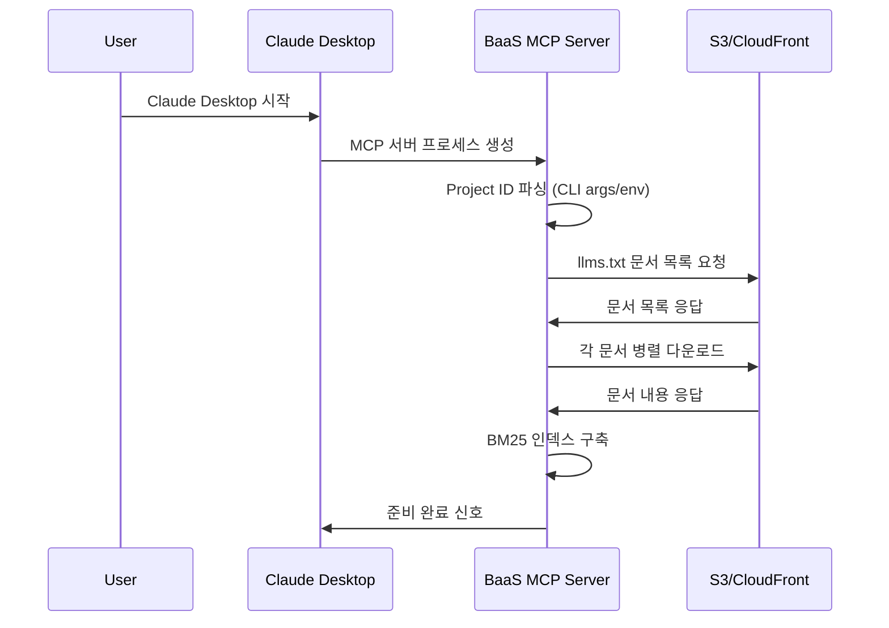
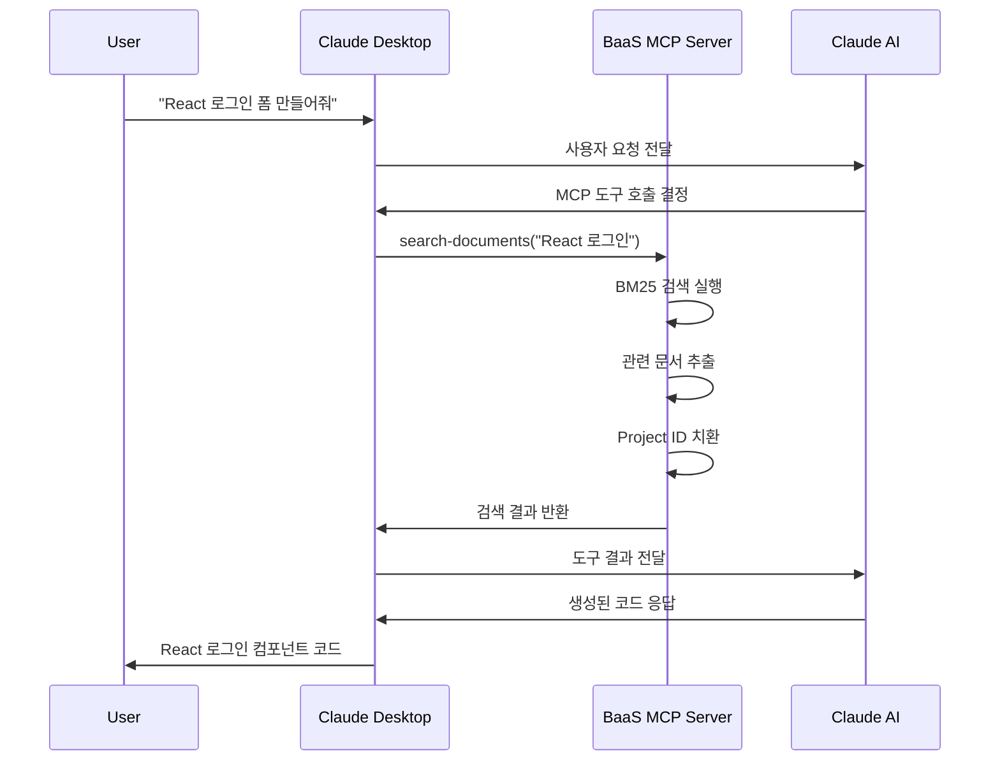

# BaaS MCP - 아키텍처와 작동 흐름

BaaS MCP 서버의 내부 구조와 작동 원리를 상세히 설명합니다.

## 📚 MCP(Model Context Protocol) 개요

### MCP란?
Model Context Protocol(MCP)는 AI 어시스턴트가 외부 도구와 데이터에 안전하게 접근할 수 있도록 하는 개방형 표준입니다.

### 주요 특징
- **표준화된 통신**: JSON-RPC 2.0 기반의 일관된 메시지 형식
- **보안성**: 샌드박스 환경에서 안전한 도구 실행
- **확장성**: 다양한 도구와 데이터 소스를 플러그인 방식으로 추가
- **상호 운용성**: Claude, Cursor 등 다양한 AI 클라이언트와 호환

### BaaS MCP의 역할
```
┌─────────────────┐    MCP Protocol    ┌─────────────────┐    HTTP/API    ┌─────────────────┐
│                 │ ◄──────────────── │                 │ ◄───────────► │                 │
│   AI Assistant  │                   │   BaaS MCP      │               │   AIApp BaaS    │
│   (Claude)      │ ──────────────────► │   Server        │ ──────────────► │   Backend       │
│                 │    Tool Calls      │                 │   Document    │                 │
└─────────────────┘                    └─────────────────┘   Fetching    └─────────────────┘
```

- **문서 브릿지**: AI와 BaaS 문서 간의 연결고리
- **코드 생성기**: 프레임워크별 클라이언트 코드 자동 생성
- **컨텍스트 제공자**: 운영 중인 API 규격과 최신 정보 제공

## 🏗️ 시스템 아키텍처

### 전체 시스템 구성도

```
┌───────────────────────────────────────────────────────────────────────────────┐
│                              Claude Desktop                                   │
│  ┌─────────────────┐                                                          │
│  │   User Query    │ "React 로그인 폼 만들어줘"                                    │
│  └─────────┬───────┘                                                          │
│            │                                                                  │
│            ▼                                                                  │
│  ┌─────────────────┐    MCP Protocol (JSON-RPC 2.0)                          │
│  │  MCP Client     │ ◄──────────────────────────────────────┐                 │
│  └─────────────────┘                                        │                 │
└───────────────────────────────────────────────────────────┼─────────────────┘
                                                             │
            stdio (stdin/stdout)                             │
                                                             ▼
┌───────────────────────────────────────────────────────────────────────────────┐
│                            BaaS MCP Server                                    │
│                                                                               │
│  ┌─────────────────┐    ┌─────────────────┐    ┌─────────────────┐          │
│  │ StdioTransport  │───►│  Tool Router    │───►│ Tool Handlers   │          │
│  │                 │    │                 │    │                 │          │
│  │ • Message       │    │ • search-docs   │    │ • Document      │          │
│  │   Parsing       │    │ • get-by-id     │    │   Search        │          │
│  │ • Response      │    │ • get-by-cat    │    │ • Content       │          │
│  │   Formatting    │    │ • get-config    │    │   Processing    │          │
│  └─────────────────┘    └─────────────────┘    └─────────────────┘          │
│                                   │                       │                  │
│                                   ▼                       ▼                  │
│  ┌─────────────────┐    ┌─────────────────┐    ┌─────────────────┐          │
│  │ Project ID      │    │ Document        │    │ BM25 Search     │          │
│  │ Manager         │    │ Repository      │    │ Algorithm       │          │
│  │                 │    │                 │    │                 │          │
│  │ • CLI Args      │    │ • In-Memory     │    │ • TF-IDF        │          │
│  │ • Env Vars      │    │   Storage       │    │ • Relevance     │          │
│  │ • Placeholder   │    │ • BM25 Index    │    │   Scoring       │          │
│  │   Replacement   │    │ • Metadata      │    │ • Query Match   │          │
│  └─────────────────┘    └─────────────────┘    └─────────────────┘          │
│                                   │                                          │
│                                   ▼                                          │
│                        ┌─────────────────┐                                  │
│                        │ Document Loader │                                  │
│                        │                 │                                  │
│                        │ • HTTP Fetch    │                                  │
│                        │ • Markdown      │                                  │
│                        │   Parsing       │                                  │
│                        │ • Token Count   │                                  │
│                        └─────────────────┘                                  │
└───────────────────────────────────────────┼───────────────────────────────────┘
                                            │
            HTTPS Request                   │
                                            ▼
┌───────────────────────────────────────────────────────────────────────────────┐
│                        S3 + CloudFront CDN                                   │
│                                                                               │
│  ┌─────────────────┐    ┌─────────────────┐    ┌─────────────────┐          │
│  │ S3 Bucket       │    │ CloudFront      │    │ Document Files  │          │
│  │ (bass-docs)     │───►│ Distribution    │───►│                 │          │
│  │                 │    │                 │    │ • API Specs     │          │
│  │ • Static Files  │    │ • Global CDN    │    │ • Templates     │          │
│  │ • Version Ctrl  │    │ • Edge Cache    │    │ • Guides        │          │
│  │ • Public Access │    │ • SSL/HTTPS     │    │ • Examples      │          │
│  └─────────────────┘    └─────────────────┘    └─────────────────┘          │
│                                                                               │
│                     https://docs.aiapp.link                                  │
└───────────────────────────────────────────────────────────────────────────────┘
```

### 핵심 컴포넌트

#### 1. StdioServerTransport
```typescript
// 표준 입출력을 통한 Claude Desktop과의 통신
const transport = new StdioServerTransport();
```

**역할**:
- Claude Desktop과 JSON-RPC 메시지 교환
- 메시지 직렬화/역직렬화
- 에러 처리 및 예외 상황 관리

#### 2. Tool Handlers
```typescript
server.tool("search-documents", searchDocuments);
server.tool("get-document-by-id", getDocumentById);
server.tool("get-documents-by-category", getDocumentsByCategory);
server.tool("get-project-config", getProjectConfig);
```

**각 도구별 역할**:
- `search-documents`: BM25 알고리즘으로 문서 검색
- `get-document-by-id`: ID로 특정 문서 조회
- `get-documents-by-category`: 카테고리별 문서 필터링
- `get-project-config`: Project ID 설정 상태 확인

#### 3. Document Repository
```typescript
class BaaSDocsRepository {
  private documents: BaaSDocument[] = [];
  private tokenizer: Tokenizer;
  private bm25Index: BM25Index;
}
```

**기능**:
- 메모리 내 문서 저장
- BM25 검색 인덱스 구축
- 문서 메타데이터 관리

## 🔄 작동 흐름

### 1. 서버 시작 흐름



**세부 단계**:

1. **서버 초기화**
   ```typescript
   const server = new Server({
     name: "aiapp-baas-mcp",
     version: "2.0.3"
   });
   ```

2. **Project ID 파싱**
   ```typescript
   function parseProjectId(): string | null {
     const args = process.argv.slice(2);
     const projectIdArg = args.find(arg => arg.startsWith('--project-id='));
     return projectIdArg?.split('=')[1] || process.env.BAAS_PROJECT_ID || null;
   }
   ```

3. **문서 로딩**
   ```typescript
   const repository = await createBaaSDocsRepository(
     "https://docs.aiapp.link/llms.txt"
   );
   ```

4. **도구 등록**
   ```typescript
   server.tool("search-documents", createSearchDocumentsTool(repository, projectId));
   ```

### 2. 사용자 요청 처리 흐름



**세부 과정**:

#### 2.1 도구 호출 수신
```json
{
  "jsonrpc": "2.0",
  "method": "tools/call",
  "params": {
    "name": "search-documents",
    "arguments": {
      "query": "React 로그인",
      "category": "templates",
      "limit": 3
    }
  }
}
```

#### 2.2 BM25 검색 실행
```typescript
searchDocuments(query: string, category?: string, limit: number = 5): BaaSDocument[] {
  // 1. 쿼리 토큰화
  const queryTerms = this.tokenize(query);
  
  // 2. BM25 스코어 계산
  const scores = this.documents.map(doc => ({
    document: doc,
    score: this.calculateBM25Score(doc, queryTerms)
  }));
  
  // 3. 스코어순 정렬 및 반환
  return scores
    .sort((a, b) => b.score - a.score)
    .slice(0, limit)
    .map(item => item.document);
}
```

#### 2.3 Project ID 치환
```typescript
// 문서 내용에서 [PROJECT_ID] 플레이스홀더 교체
if (projectId) {
  contentText = contentText.replace(/\[PROJECT_ID\]/g, projectId);
  responseText += `> 📌 **현재 Project ID**: \`${projectId}\`\n`;
}
```

#### 2.4 응답 반환
```json
{
  "jsonrpc": "2.0",
  "result": {
    "content": [{
      "type": "text", 
      "text": "# React 로그인 컴포넌트\n\n```tsx\nimport { useState } from 'react';\n..."
    }]
  }
}
```

### 3. BM25 알고리즘 동작 원리

BM25(Best Matching 25)는 정보 검색에서 사용하는 확률적 랭킹 함수입니다.

#### 수식
```
Score(D,Q) = Σ(i=1 to n) IDF(qi) × (f(qi,D) × (k1 + 1)) / (f(qi,D) + k1 × (1 - b + b × |D|/avgdl))
```

**파라미터**:
- `k1 = 1.2`: 용어 빈도 포화 조절
- `b = 0.75`: 문서 길이 정규화 조절
- `IDF`: Inverse Document Frequency
- `f(qi,D)`: 문서 D에서 용어 qi의 빈도
- `|D|`: 문서 D의 길이
- `avgdl`: 전체 문서의 평균 길이

#### 구현 예시
```typescript
private calculateBM25Score(document: BaaSDocument, queryTerms: string[]): number {
  const k1 = 1.2;
  const b = 0.75;
  const docTokens = this.tokenize(document.getContent());
  const docLength = docTokens.length;
  const avgDocLength = this.calculateAverageDocumentLength();

  return queryTerms.reduce((score, term) => {
    const termFreq = this.getTermFrequency(docTokens, term);
    const idf = this.calculateIDF(term);
    
    const numerator = termFreq * (k1 + 1);
    const denominator = termFreq + k1 * (1 - b + b * (docLength / avgDocLength));
    
    return score + (idf * numerator / denominator);
  }, 0);
}
```

## 📊 데이터 흐름

### 문서 로딩 과정

```
S3 Bucket (bass-docs)
├── llms.txt                     ← 1. 문서 목록 요청
├── api/auth/signup.md          ← 2. 개별 문서 다운로드
├── templates/react/login.md    ← 3. 병렬 처리로 성능 최적화
└── ...

↓ HTTP Fetch (병렬)

Memory Storage
├── BaaSDocument[]              ← 4. 메모리에 저장
├── BM25 Index                  ← 5. 검색 인덱스 구축
└── Metadata Cache              ← 6. 메타데이터 캐시
```

### 검색 요청 처리

```
User Query: "Vue 회원가입"
    ↓ Tokenization
["vue", "회원가입", "signup", "register"]
    ↓ BM25 Scoring
Document Scores:
- vue/signup-component.md: 8.5
- templates/vue/auth.md: 6.2
- api/auth/signup.md: 4.1
    ↓ Sort & Limit
Top 3 Results:
1. Vue 회원가입 컴포넌트 (score: 8.5)
2. Vue 인증 시스템 (score: 6.2)  
3. 회원가입 API (score: 4.1)
```

## 🔧 성능 최적화

### 1. 문서 로딩 최적화
- **병렬 다운로드**: 모든 문서를 동시에 다운로드
- **캐시 활용**: CloudFront CDN으로 전역 캐시
- **압축 전송**: gzip 압축으로 전송량 최소화

### 2. 검색 성능 최적화
- **인덱스 사전 구축**: 서버 시작 시 BM25 인덱스 생성
- **메모리 저장**: 모든 문서를 메모리에 캐시
- **토큰화 캐시**: 문서별 토큰 결과 캐시

### 3. 응답 시간 최적화
```typescript
// 평균 응답 시간 목표
- 문서 검색: < 100ms
- 문서 조회: < 50ms
- 설정 확인: < 10ms
```

## 🛡️ 보안 고려사항

### 1. 문서 접근 보안
- **공개 문서만**: S3에서 공개 문서만 제공
- **HTTPS 전용**: 모든 통신은 HTTPS로 암호화
- **권한 최소화**: MCP 서버는 읽기 전용 접근

### 2. Project ID 보안
- **환경 변수**: 민감한 Project ID는 환경 변수로 관리
- **로그 제외**: Project ID를 로그에 기록하지 않음
- **플레이스홀더**: 예제 코드에서는 플레이스홀더 사용

### 3. 입력 검증
```typescript
// 사용자 입력 검증
if (!query || typeof query !== 'string') {
  throw new Error('Invalid query parameter');
}

if (limit && (limit < 1 || limit > 20)) {
  throw new Error('Limit must be between 1 and 20');
}
```

## 📈 모니터링 및 로깅

### 로그 레벨
```typescript
// 개발 환경에서만 디버그 로그 출력
if (process.env.NODE_ENV === 'development') {
  console.log('[DEBUG] Search query:', query);
  console.log('[DEBUG] Results count:', results.length);
}
```

### 성능 메트릭
- 문서 로딩 시간
- 평균 검색 응답 시간
- 메모리 사용량
- 요청 처리 빈도

## 📞 기술 지원

아키텍처 관련 문의:
- 📧 Email: architecture@aiapp.link
- 💬 Discord: [개발자 채널]
- 📚 문서: https://docs.aiapp.link/architecture

---

**Built with ❤️ by AIApp Team**