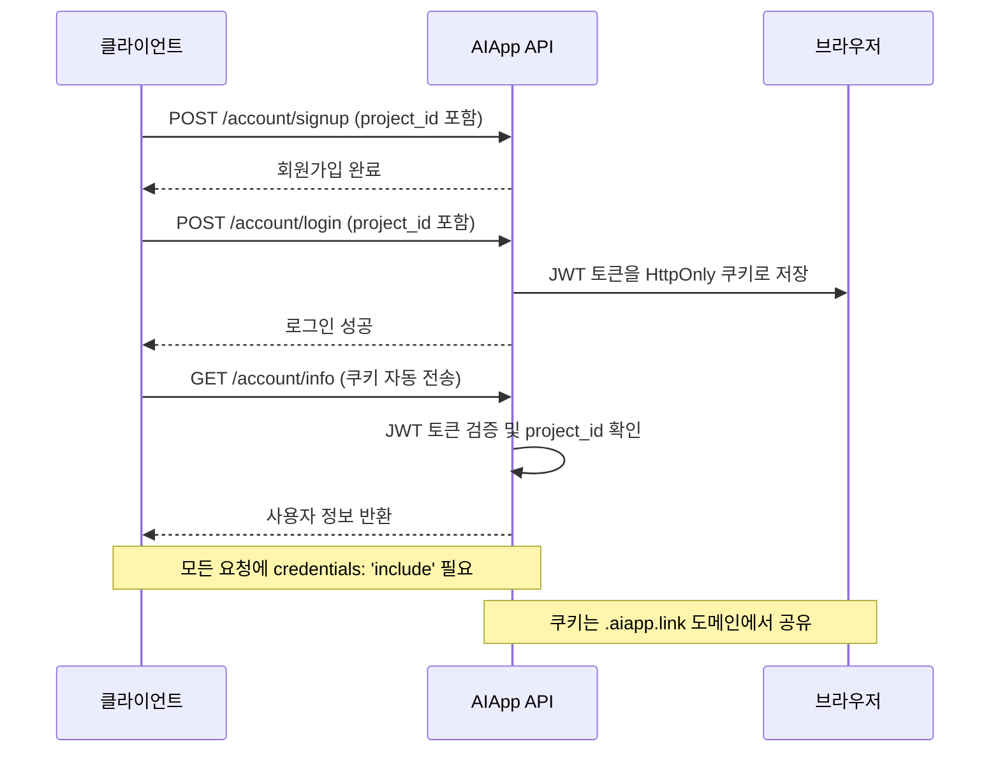

# 인증 플로우 가이드

클라이언트 관점에서 AIApp BaaS 인증 시스템의 동작 방식과 구현 방법을 설명합니다.

## 🔐 인증 시스템 개요

AIApp BaaS는 **멀티테넌트 인증 서비스**로, 각 프로젝트가 독립적인 사용자 베이스를 가집니다.

```
프로젝트 A (project-id-a) → 독립된 사용자 그룹
프로젝트 B (project-id-b) → 독립된 사용자 그룹
프로젝트 C (project-id-c) → 독립된 사용자 그룹
```

## 📋 프로젝트 ID 확인

모든 인증 API 호출에는 `project_id`가 필수입니다.

```javascript
const PROJECT_ID = "[PROJECT_ID]"; // 실제 프로젝트 ID로 변경
```

> **프로젝트 ID를 모르시나요?**  
> AIApp 관리자에게 문의하거나 기존 프로젝트 설정에서 확인할 수 있습니다.

## 🚀 인증 플로우

### 1단계: 회원가입 (POST /account/signup)

새로운 사용자를 프로젝트에 등록합니다.

```javascript
const signupData = {
  user_id: "johndoe",
  user_pw: "password123",
  name: "John Doe",
  phone: "010-1234-5678",
  is_reserved: false,
  project_id: PROJECT_ID, // 필수
  data: {
    age: 25,
    department: "개발팀"
  }
};

const response = await fetch('https://api.aiapp.link/account/signup', {
  method: 'POST',
  headers: { 'Content-Type': 'application/json' },
  credentials: 'include',
  body: JSON.stringify(signupData)
});
```

**성공 응답**:
```json
{
  "result": "SUCCESS",
  "message": "회원가입이 완료되었습니다.",
  "data": {
    "user_id": "johndoe",
    "name": "John Doe",
    "project_id": "[PROJECT_ID]"
  }
}
```

### 2단계: 로그인 (POST /account/login)

사용자 인증 후 JWT 토큰을 받고 쿠키에 자동 저장됩니다.

```javascript
const loginData = {
  user_id: "johndoe",
  user_pw: "password123",
  project_id: PROJECT_ID // 필수
};

const response = await fetch('https://api.aiapp.link/account/login', {
  method: 'POST',
  headers: { 'Content-Type': 'application/json' },
  credentials: 'include', // 쿠키 포함
  body: JSON.stringify(loginData)
});
```

**성공 시 자동 처리**:
- JWT 토큰이 HttpOnly 쿠키로 설정
- 서브도메인 간 쿠키 공유 (`.aiapp.link`)
- 보안 설정 자동 적용

**쿠키 설정 예시**:
```http
Set-Cookie: access_token=eyJ...; HttpOnly; Secure; Domain=.aiapp.link; SameSite=None; Max-Age=86400
```

### 3단계: 사용자 정보 조회 (GET /account/info)

로그인 상태에서 현재 사용자 정보를 가져옵니다.

```javascript
const response = await fetch('https://api.aiapp.link/account/info', {
  method: 'GET',
  credentials: 'include' // 쿠키의 JWT 토큰 사용
});

const userInfo = await response.json();
```

**성공 응답**:
```json
{
  "result": "SUCCESS",
  "data": {
    "user_id": "johndoe",
    "name": "John Doe",
    "phone": "010-1234-5678",
    "project_id": "[PROJECT_ID]",
    "data": {
      "age": 25,
      "department": "개발팀"
    }
  }
}
```

## 🔄 전체 인증 플로우



## ⚙️ 중요한 설정사항

### 1. CORS 및 쿠키 설정

```javascript
// 모든 API 요청에 포함 필수
const apiCall = async (url, options = {}) => {
  return fetch(url, {
    ...options,
    credentials: 'include', // 쿠키 포함
    headers: {
      'Content-Type': 'application/json',
      ...options.headers
    }
  });
};
```

### 2. 에러 처리

```javascript
const handleApiResponse = async (response) => {
  if (!response.ok) {
    const error = await response.json();
    
    switch (response.status) {
      case 401:
        // 인증 실패 - 로그인 페이지로 리디렉션
        window.location.href = '/account/login';
        break;
      case 422:
        // 입력값 오류
        console.error('입력값을 확인해주세요:', error.detail);
        break;
      default:
        console.error('API 오류:', error.message);
    }
    
    throw new Error(error.message);
  }
  
  return response.json();
};
```

### 3. 로그인 상태 확인

```javascript
const checkAuthStatus = async () => {
  try {
    const response = await fetch('https://api.aiapp.link/account/info', {
      credentials: 'include'
    });
    
    if (response.ok) {
      const userData = await response.json();
      return userData.data; // 사용자 정보 반환
    }
    
    return null; // 미로그인
  } catch (error) {
    console.error('인증 상태 확인 실패:', error);
    return null;
  }
};
```

## 🌐 도메인별 구현 예제

### 프로젝트별 설정

```javascript
// myproject.aiapp.link에서 사용할 경우
const CONFIG = {
  PROJECT_ID: 'myproject-uuid-here',
  API_ENDPOINT: 'https://api.aiapp.link',
  COOKIE_DOMAIN: '.aiapp.link'
};

// 커스텀 도메인에서 사용할 경우  
const CONFIG = {
  PROJECT_ID: 'custom-project-uuid-here',
  API_ENDPOINT: 'https://api.aiapp.link',
  COOKIE_DOMAIN: '.mycustomdomain.com' // 백엔드 설정에 따라 다름
};
```

### 환경별 설정

```javascript
const getConfig = () => {
  const hostname = window.location.hostname;
  
  if (hostname.includes('localhost')) {
    return {
      PROJECT_ID: 'dev-project-id',
      API_ENDPOINT: 'https://dev-api.aiapp.link'
    };
  }
  
  if (hostname.includes('.aiapp.link')) {
    const projectName = hostname.split('.')[0];
    return {
      PROJECT_ID: getProjectIdByName(projectName),
      API_ENDPOINT: 'https://api.aiapp.link'
    };
  }
  
  return {
    PROJECT_ID: 'production-project-id',
    API_ENDPOINT: 'https://api.aiapp.link'
  };
};
```

## 🚨 보안 고려사항

### 1. JWT 토큰 관리
- 토큰은 HttpOnly 쿠키로만 저장 (XSS 방지)
- LocalStorage나 SessionStorage 사용 금지
- 자동 만료 및 갱신 처리

### 2. HTTPS 필수
- 프로덕션 환경에서는 반드시 HTTPS 사용
- `Secure` 쿠키 속성으로 HTTPS에서만 전송

### 3. 프로젝트 ID 보안
- 프로젝트 ID는 민감한 정보가 아니지만 노출 최소화
- 환경변수나 설정 파일로 관리 권장

## 📱 프레임워크별 구현

이 플로우는 다음 환경에서 동일하게 작동합니다:

- **React**: useAuth 훅으로 상태 관리
- **Vue 3**: Composition API로 반응형 상태
- **순수 JavaScript**: 클래스 기반 상태 관리
- **Next.js**: 서버사이드 렌더링 지원

자세한 구현 예제는 MCP 서버를 통해 자동 생성할 수 있습니다.

---

**💡 팁**: 이 플로우를 기반으로 MCP 서버가 프레임워크별 코드를 자동 생성해드립니다!